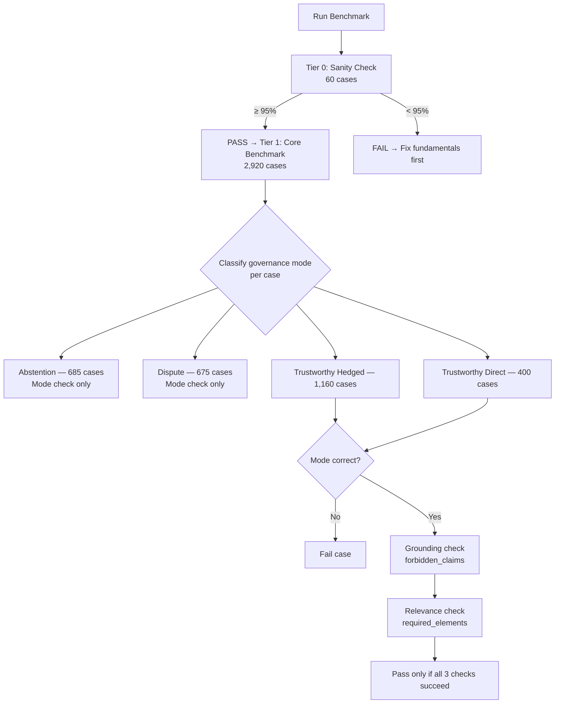

<div align="center">

# fitz-gov

### A benchmark for measuring whether RAG systems know when to answer, when to push back, and when to shut up.

[](https://www.python.org/downloads/)
[](https://pypi.org/project/fitz-gov/)
[](LICENSE)
[](CHANGELOG.md)

[The Problem](#the-problem) • [Three Modes](#the-three-modes-) • [What Makes This Hard](#what-makes-this-hard-) • [Quick Start](#-quick-start) • [GitHub](https://github.com/yafitzdev/fitz-gov)

</div>

<br />

---

```python
from fitz_gov import FitzGovEvaluator, load_tier, Tier

tier0 = load_tier(Tier.SANITY)   # 60 sanity cases
tier1 = load_tier(Tier.CORE)     # 2,920 real cases

evaluator = FitzGovEvaluator()
result = evaluator.evaluate_tiered(tier0_cases, ..., tier1_cases, ...)
print(result)
```

2,980 test cases. One score that tells you if your RAG system knows what it doesn't know.

---

### About 🧑‍🌾

Solo project by Yan Fitzner ([LinkedIn](https://www.linkedin.com/in/yan-fitzner/), [GitHub](https://github.com/yafitzdev)).

- ~4k lines of Python, 2,980 hand-labeled benchmark cases
- 107 tests
- Built for [fitz-ai](https://github.com/yafitzdev/fitz-ai) — used to train and validate its governance classifier (81.3% accuracy on 2,910 hard cases)

---

### The Problem

Every RAG benchmark today measures the same thing: *did the system get the right answer?* BEIR measures retrieval. RAGAS measures generation quality. But none of them measure the thing that actually matters in production: **does the system know what it doesn't know?**

Ask a typical RAG system "What was Acme Corp's revenue last quarter?" and give it context that only mentions Acme Corp's founding date. Most systems will confidently hallucinate a revenue figure. A well-governed system would say "the provided context doesn't contain revenue information."

Give it two analyst reports that directly contradict each other — one says the market is growing 12%, the other says it's shrinking 3%. Most systems will pick one and present it as fact. A well-governed system would flag the contradiction.

This is the **governance problem**: RAG systems need to make a meta-decision about their own evidence *before* they generate an answer. Should I answer confidently? Hedge? Flag conflicting sources? Refuse entirely?

fitz-gov measures that meta-decision.

---

### The Three Modes 🔀

Every query + context pair maps to one of three governance modes:

**TRUSTWORTHY** ✅ — Sufficient evidence. Answer confidently or with appropriate hedging.
> *"What is the boiling point of water at sea level?"*
> *Context: "At standard atmospheric pressure, pure water boils at 100°C."*
> → Answer directly.

**DISPUTED** ⚠️ — Conflicting information. Surface the contradiction, don't pick a side.
> *"Is remote work more productive?"*
> *Context A: "Stanford found remote workers were 13% more productive."*
> *Context B: "Microsoft found remote work decreased collaboration by 25%."*
> → Present both sides.

**ABSTAIN** 🚫 — Irrelevant, insufficient, or wrong entity/time period. Refuse to answer.
> *"What are the side effects of ibuprofen?"*
> *Context: "Python was created by Guido van Rossum in 1991."*
> → "I don't have relevant information to answer this."

---

### What Makes This Hard 🧩

The easy cases are obvious. Nobody confuses a biology passage with a finance question. fitz-gov includes those as a sanity check, but the real benchmark lives in the hard cases:

**Near-miss abstention 🎯**
> The context discusses the right *topic* but the wrong *entity*, wrong *time period*, or wrong *jurisdiction*. "What are Tesla's Q4 earnings?" with context about Ford's Q4 earnings.

**Implicit contradiction 🔇**
> Sources don't directly say opposite things, but their claims are logically incompatible. One says a company "exceeded all growth targets" while another says it "failed to meet analyst expectations."

**Hedged vs. confident 🤔**
> The context contains a correlation study. The query asks about causation. The system should answer (TRUSTWORTHY) but hedge — not abstain, and not state correlation as proven causation.

**Methodology conflicts vs. genuine disputes 📊**
> Two studies report different numbers for the same thing. Is it because they used different methodologies (TRUSTWORTHY with caveats) or because they genuinely disagree (DISPUTED)?

These boundary cases are where production RAG systems actually fail, and where fitz-gov separates a good governance classifier from a great one.

> [!NOTE]
> 62.7% of tier1 cases are rated "hard." This is deliberate — the easy cases exist as a sanity gate, not the benchmark.

---

<details>

<summary><strong>📦 What is RAG governance?</strong></summary>

<br>

Most RAG systems have two jobs: (1) find relevant documents, (2) generate an answer. But there's a critical third job they skip: **decide whether you should answer at all.**

A governance classifier sits between retrieval and generation. It looks at the query and the retrieved context and makes a meta-decision:

```
Query + Retrieved Context
        │
        ▼
┌─────────────────┐
│   Governance    │──► TRUSTWORTHY → generate answer
│   Classifier    │──► DISPUTED    → flag contradictions
│                 │──► ABSTAIN     → refuse to answer
└─────────────────┘
```

Without governance, your RAG system will confidently answer "The company's Q4 revenue was $2.3 billion" when the context only mentions Q1-Q3 data. With governance, it says "I don't have Q4 revenue figures."

fitz-gov provides the test cases to measure how well your governance classifier makes these decisions.

</details>

---

<details>

<summary><strong>📦 Quick Start</strong></summary>

<br>

```bash
pip install fitz-gov
```

#### Tiered Evaluation

fitz-gov uses a two-tier system. Tier 0 is a 60-case sanity check (95% pass threshold) that gates Tier 1.

```python
from fitz_gov import FitzGovEvaluator, load_tier, Tier, AnswerMode

tier0_cases = load_tier(Tier.SANITY)  # 60 cases
tier1_cases = load_tier(Tier.CORE)    # 2,920 cases

# Your RAG system classifies each case
tier0_responses, tier0_modes = your_system.evaluate(tier0_cases)
tier1_responses, tier1_modes = your_system.evaluate(tier1_cases)

evaluator = FitzGovEvaluator()
result = evaluator.evaluate_tiered(
    tier0_cases, tier0_responses, tier0_modes,
    tier1_cases, tier1_responses, tier1_modes,
)

print(result)
# TIER 0 (Sanity Check): PASSED  |  95% threshold, achieved 98.3%
# TIER 1 (Core Benchmark): 69.1%
#   abstention:         84.8% (581/685)
#   dispute:            66.8% (451/675)
#   trustworthy_hedged: 71.2% (826/1160)  |  grounding: 89.3%, relevance: 85.1%
#   trustworthy_direct: 78.5% (314/400)   |  grounding: 92.1%, relevance: 88.7%
```

#### Standalone Usage

Any RAG system can be evaluated — fitz-gov is framework-agnostic:

```python
from fitz_gov import FitzGovEvaluator, load_cases, AnswerMode

cases = load_cases()  # 2,980 cases
evaluator = FitzGovEvaluator()

responses, modes = [], []
for case in cases:
    response = your_system.query(case.query, case.contexts)
    mode = your_system.classify_mode(response)
    responses.append(response)
    modes.append(mode)

results = evaluator.evaluate_all(cases, responses, modes)
print(f"Governance accuracy: {results.overall_accuracy:.1%}")
```

#### Two-Pass Validation

Grounding and relevance checks use regex + optional LLM validation:

```python
evaluator = FitzGovEvaluator(
    llm_validation=True,
    llm_model="qwen2.5:14b",
    llm_base_url="http://localhost:11434"
)
```

</details>

---

<details>

<summary><strong>📦 Interpreting Your Score</strong></summary>

<br>

A fitz-gov score is governance mode accuracy across 2,920 test cases.

| Score | Meaning |
|-------|---------|
| **90%+** | Exceptional. Almost always makes the right meta-decision. |
| **75-90%** | Strong. Handles most cases, occasional misjudgments on boundaries. |
| **60-75%** | Moderate. Gets obvious cases right, struggles with subtlety. |
| **< 60%** | Frequently making the wrong meta-decision. |

The score breaks down by category — so you can see exactly *where* your system fails. 90% on abstention but 55% on disputes? It knows when to shut up but doesn't catch contradictions. 40% on trustworthy_direct? It's being overly cautious, refusing to answer even when evidence is clear.

**Four test categories:**

| Category | Cases | Mode | What it catches |
|----------|------:|------|-----------------|
| **Abstention** | 685 | ABSTAIN | System answers when it has no relevant evidence |
| **Dispute** | 675 | DISPUTED | System ignores contradictions between sources |
| **Trustworthy Hedged** | 1,160 | TRUSTWORTHY | System over-hedges (abstains) or under-hedges (states uncertain things as fact) |
| **Trustworthy Direct** | 400 | TRUSTWORTHY | System refuses or hedges when evidence clearly supports a confident answer |

Trustworthy cases are evaluated on three dimensions: governance mode, grounding (no hallucinated details via `forbidden_claims`), and relevance (actually addresses the question via `required_elements`). A case only passes if all three checks succeed.

→ [Evaluation Guide](docs/evaluation-guide.md) for deeper analysis

</details>

---

<details>

<summary><strong>📦 Evaluation Flow</strong></summary>

<br>



</details>

---

<details>

<summary><strong>📦 Benchmark Stats</strong></summary>

<br>

**2,980 total cases** (60 tier0 sanity + 2,920 tier1 core) across **113+ subcategories**, **17 domains**, and **10 query types**.

- **Mode split:** TRUSTWORTHY 53.4% / ABSTAIN 23.5% / DISPUTED 23.1%
- **Difficulty:** 62.7% hard / 37.3% medium (tier1), easy (tier0 only)
- **Multi-source:** 264 cases (9.0%) with source metadata
- **Domains:** Technology, Medicine, Finance, Science, Education, Environment, Food, Law, Government, Transportation, Sports, Agriculture, History, HR/Workplace, Real Estate, Psychology, Social Media
- **Query types:** what, how, is, does, why, should, when, which, who, compare
- **Reasoning types:** Factual, Evaluative, Causal, Comparative, Temporal, Procedural

</details>

---

<details>

<summary><strong>📦 Data Format</strong></summary>

<br>

```
data/
├── tier0_sanity/               # 60 easy cases (95% gate)
├── tier1_core/                 # 2,920 medium/hard cases
│   ├── abstention.json         # 685 cases
│   ├── dispute.json            # 675 cases
│   ├── trustworthy_hedged.json # 1,160 cases
│   └── trustworthy_direct.json # 400 cases
├── corpus/                     # 5,043 reference documents
├── queries/                    # 3,800 query-to-document mappings
└── validation/                 # 250-case human validation sample
```

Each case:

```json
{
  "id": "t1_abstain_medium_001",
  "query": "What is the company's revenue for 2024?",
  "contexts": ["The company was founded in 2010..."],
  "expected_mode": "abstain",
  "category": "abstention",
  "subcategory": "wrong_entity",
  "difficulty": "medium",
  "domain": "finance",
  "query_type": "what",
  "source_type": "single",
  "context_count": 1,
  "reasoning_type": "factual",
  "evidence_pattern": "absent",
  "forbidden_claims": ["\\$\\d+\\s*billion"],
  "required_elements": ["revenue", "not provided"]
}
```

Every case has 6 classification attributes for slicing results. Trustworthy cases additionally have `forbidden_claims` (grounding) and `required_elements` (relevance) for quality scoring.

</details>

---

<details>

<summary><strong>📦 Full Distribution Tables</strong></summary>

<br>

#### Categories (Tier 1)

| Category | Cases | Medium | Hard | Med % |
|----------|------:|-------:|-----:|------:|
| Abstention | 685 | 255 | 430 | 37% |
| Dispute | 675 | 261 | 414 | 39% |
| Trustworthy Hedged | 1,160 | 428 | 732 | 37% |
| Trustworthy Direct | 400 | 145 | 255 | 36% |

#### Domain Distribution

| Domain | Cases | % | Domain | Cases | % |
|--------|------:|--:|--------|------:|--:|
| Technology | 412 | 14.1% | Transportation | 131 | 4.5% |
| Medicine | 309 | 10.6% | Sports | 127 | 4.3% |
| Finance | 296 | 10.1% | Agriculture | 126 | 4.3% |
| Science | 192 | 6.6% | History | 122 | 4.2% |
| Government | 155 | 5.3% | HR/Workplace | 121 | 4.1% |
| Education | 152 | 5.2% | Real Estate | 119 | 4.1% |
| Environment | 147 | 5.0% | Psychology | 119 | 4.1% |
| Food | 143 | 4.9% | Social Media | 113 | 3.9% |
| Law | 136 | 4.7% | | | |

#### Query Type Distribution

| Type | Cases | % | Type | Cases | % |
|------|------:|--:|------|------:|--:|
| what | 821 | 28.1% | should | 135 | 4.6% |
| how | 694 | 23.8% | when | 121 | 4.1% |
| is | 437 | 15.0% | which | 97 | 3.3% |
| does | 284 | 9.7% | who | 77 | 2.6% |
| why | 213 | 7.3% | compare | 41 | 1.4% |

#### Reasoning Type Distribution

| Reasoning Type | Cases | % |
|----------------|------:|--:|
| Factual | 1,588 | 54.4% |
| Evaluative | 596 | 20.4% |
| Causal | 239 | 8.2% |
| Comparative | 187 | 6.4% |
| Temporal | 178 | 6.1% |
| Procedural | 132 | 4.5% |

#### Evidence Pattern Distribution

| Evidence Pattern | Cases | % |
|------------------|------:|--:|
| Direct | 1,039 | 35.6% |
| Absent | 637 | 21.8% |
| Conflicting | 587 | 20.1% |
| Partial | 428 | 14.7% |
| Indirect | 195 | 6.7% |
| Mixed | 34 | 1.2% |

#### Subcategories

**Abstention** (23): wrong_entity, wrong_specificity, temporal_mismatch, missing_data, off_topic_contradiction, wrong_domain, wrong_jurisdiction, outdated_context, wrong_product, cross_domain_insufficient, decoy_keywords, converted_insufficient, converted_off_domain, wrong_version, implicit_only, wrong_granularity, converted_wrong_entity, multi_source_gap, cross_source_irrelevant, code_abstention, topic_adjacent, format_impossible, converted_wrong_scope

**Dispute** (19): numerical_conflict, implicit_contradiction, binary_conflict, opposing_conclusions, temporal_conflict, statistical_direction_conflict, source_authority_conflict, methodology_conflict, interpretation_conflict, competing_theories, scientific_replication, cross_source_contradiction, converted_contradiction, conditional_conflict, converted_consensus_removed, converted_framing_conflict, temporal_source_conflict, contradictory_attribution, converted_version_conflict

**Trustworthy Hedged** (57): evidence_quality, hedged_evidence, different_aspects, causal_uncertainty, mixed_evidence, temporal_uncertainty, version_overlap, methodology_difference, stale_source, evolving_facts, entity_ambiguity, partial_answer, scope_condition, numerical_near_miss, cross_source_partial, implicit_assumptions, adjacent_entity, cross_domain_transfer, hedged_contradiction_corroborated, different_framing, grounding_numerical_hallucination, grounding_attribution_hallucination, grounding_temporal_confusion, grounding_entity_blending, grounding_process_hallucination, grounding_quote_fabrication, grounding_statistical_inference, grounding_code_hallucination, grounding_table_inference, grounding_causal_hallucination, grounding_comparative_hallucination, grounding_geographic_hallucination, grounding_technical_hallucination, grounding_date_hallucination, grounding_location_hallucination, grounding_code_grounding, grounding_medical_hallucination, grounding_quote_extension, relevance_partial_answer, relevance_wrong_entity_focus, relevance_temporal_mismatch, relevance_tangent_drift, relevance_related_but_different, relevance_over_answering, relevance_granularity_mismatch, relevance_prerequisite_missing, relevance_scope_mismatch, relevance_format_mismatch, relevance_summarization_vs_answer, relevance_cherry_picking, relevance_false_precision, relevance_assumption_injection, relevance_symptom_only, relevance_status_dump, relevance_feature_dump, relevance_instruction_only, relevance_metric_avoidance

**Trustworthy Direct** (14): technical_documented, clear_explanation, contradiction_resolved, opposing_with_consensus, different_framing, quantitative_answer, cross_source_agreement, direct_factual, multi_source_convergence, authoritative_source, near_complete_evidence, conditional_confidence, step_by_step, definitional

</details>

---

<details>

<summary><strong>📦 Contributing</strong></summary>

<br>

1. Fork this repo
2. Add cases to the appropriate `data/tier0_sanity/` or `data/tier1_core/` JSON file
3. Run validation: `python -m fitz_gov.cli validate --data-dir data`
4. Submit a PR

→ [Mode Decision Tree](docs/mode-decision-tree.md) — how expected modes are assigned

</details>

---

### License

MIT

---

### Links

- [GitHub](https://github.com/yafitzdev/fitz-gov)
- [PyPI](https://pypi.org/project/fitz-gov/)
- [Changelog](CHANGELOG.md)

**Documentation:**
- [Evaluation Guide](docs/evaluation-guide.md) — How to interpret scores and diagnose failures
- [Mode Decision Tree](docs/mode-decision-tree.md) — How expected modes are assigned to test cases
