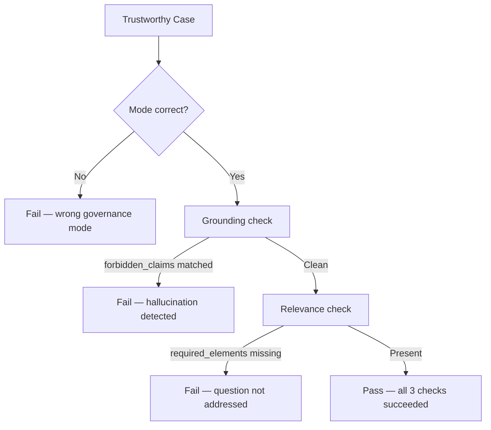

# fitz-gov Evaluation Guide

> **Version**: 6.0.0
> **Last Updated**: 2026-05-20

This guide explains how to interpret fitz-gov benchmark results and understand what the scores mean for your RAG system.

---

## Tiered Evaluation Structure

fitz-gov uses a two-tier evaluation system:

### Tier 0: Sanity Check

| Property | Value |
|----------|-------|
| Cases | 60 |
| Threshold | 95% |
| Purpose | Baseline functionality verification |
| Failure meaning | Model lacks fundamental governance awareness |

**Interpretation:**
- **PASS (>=95%)**: Model has basic epistemic governance capability. Proceed to Tier 1.
- **FAIL (<95%)**: Model has fundamental issues. Fix these before meaningful Tier 1 evaluation.

Tier 0 cases are intentionally easy:
- Complete domain mismatches (biology context for finance question)
- Binary contradictions (approved vs rejected)
- Obvious missing information

If a model fails Tier 0, it indicates serious problems with:
- Context relevance detection
- Contradiction recognition
- Basic information extraction

### Tier 1: Core Benchmark

| Property | Value |
|----------|-------|
| Cases | 2,920 |
| Categories | 4 (abstention / dispute / trustworthy_hedged / trustworthy_direct) |
| Scoring | Gradient (0-100%) |
| Unique subcategories | 113 |
| Difficulty | 37.3% medium / 62.7% hard |
| Expected range | 60-75% for production models |
| Purpose | Discriminate between good and excellent governance |

**Interpretation:**
- **<55%**: Significant governance issues
- **55-65%**: Acceptable for non-critical applications
- **65-75%**: Good governance capability
- **>75%**: Excellent governance capability

---

## Category Breakdown

fitz-gov v6.0 uses 4 test categories (unchanged since v5.0). All categories test governance mode classification. Trustworthy categories additionally run cross-cutting quality checks.

### Abstention (685 Tier 1 cases)

Tests whether your system refuses to answer when context is insufficient.

**Subcategory clusters**: wrong entity, wrong specificity, temporal mismatch, missing data, off-topic contradiction, wrong domain, wrong jurisdiction, outdated context, wrong product, cross-domain insufficient, decoy keywords, code abstention, and more.

**Common failure patterns:**
- Answering with general knowledge when context is irrelevant
- Attempting to answer questions about wrong entities
- Not recognizing temporal mismatches (old data for current questions)
- Being confused by decoy keywords (shares vocabulary but different topic)
- Missing version mismatches (v2.1 context for v2.0 question)

**What good systems do:**
- Clearly state "I cannot answer this based on the provided context"
- Identify specifically what information is missing
- Don't attempt to extrapolate beyond available evidence
- Resist high embedding similarity when entities don't match

### Dispute (675 Tier 1 cases)

Tests whether your system recognizes and flags conflicting information.

**Subcategory clusters**: numerical conflict, implicit contradiction, binary conflict, opposing conclusions, temporal conflict, statistical direction conflict, source authority conflict, methodology conflict, interpretation conflict, competing theories, scientific replication, and more.

**Common failure patterns:**
- Cherry-picking one source without acknowledging conflict
- Averaging contradictory numbers without noting disagreement
- Missing implicit contradictions (incompatible claims)
- Confusing methodology differences with factual disputes
- Missing binary fact conflicts (approved vs rejected)

**What good systems do:**
- Explicitly note when sources disagree
- Present both perspectives fairly
- Explain the nature of the conflict
- Distinguish genuine disputes from methodology differences

### Trustworthy Hedged (1,160 Tier 1 cases)

Tests whether your system appropriately hedges uncertain claims. Cases in this category expect TRUSTWORTHY mode with appropriate hedging language. This is the largest and most nuanced category.

**Subcategory clusters**: evidence quality, hedged evidence, different aspects, causal uncertainty, mixed evidence, temporal uncertainty, methodology difference, evolving facts, entity ambiguity, partial answer, scope condition, numerical near-miss, grounding hallucination types (18 subcategories), relevance quality types (19 subcategories), and more.

**Common failure patterns:**
- Presenting correlations as causation
- Stating outcomes without noting limited evidence
- Extrapolating confidently from insufficient data
- Treating methodology differences as factual contradictions
- Ignoring hedging language in source material ("may", "suggests")
- Hallucinating specific numbers, quotes, or dates not in context
- Answering a related but different question

**What good systems do:**
- Use hedging language ("may", "suggests", "based on limited data")
- Distinguish between what is stated vs. implied
- Note when causal explanations are not provided
- Recognize that different values can reflect different methodologies, not disputes
- Only include information present in or derivable from context
- Directly address the specific question asked

### Trustworthy Direct (400 Tier 1 cases)

Tests whether your system answers confidently when evidence is clear. Cases in this category expect TRUSTWORTHY mode with direct, confident language.

**Subcategory clusters**: technical documented, clear explanation, contradiction resolved, opposing with consensus, different framing, quantitative answer, cross-source agreement, direct factual, multi-source convergence, step-by-step, definitional, and more.

**Common failure patterns:**
- Over-hedging when answer is clearly stated
- Adding unnecessary caveats to explicit facts
- Being too cautious when context directly answers the question
- Treating apparent contradictions as disputes when they're resolved by context
- Failing to recognize when multiple sources converge on the same answer

**What good systems do:**
- Provide direct answers when context clearly supports them
- Don't add artificial uncertainty to well-established facts
- Recognize when apparent contradictions are resolved (different framing, methodology explained)
- Trust strong consensus across multiple sources

---

## Cross-Cutting Quality Checks

In v5.0, grounding and relevance are no longer standalone categories. They are quality dimensions applied to every trustworthy case (hedged and direct).

### How It Works



### Grounding

Tests whether responses stay grounded in context (no hallucination). Evaluated via `forbidden_claims` regex patterns on each trustworthy case.

**What it catches**: Inventing specific numbers, fabricating quotes, adding training-data details not in context, hallucinating function parameters, inventing table data.

### Relevance

Tests whether responses address the actual question asked. Evaluated via `required_elements` pattern matching on each trustworthy case.

**What it catches**: Answering a related but different question, summarizing context instead of answering, providing information about wrong entity/timeframe, dumping features when pricing was asked.

### 3-Dimensional Scoring

Trustworthy categories report three scores:

```
trustworthy_hedged: 71.2% (826/1160)  |  grounding: 89.3%  relevance: 85.1%
trustworthy_direct: 78.5% (314/400)   |  grounding: 92.1%  relevance: 88.7%
```

A trustworthy case only passes if **all three** checks succeed. Quality checks are conditional — if the system picks the wrong governance mode, quality checks are skipped (no point checking answer quality when the meta-decision is wrong).

---

## Confusion Matrix Interpretation

The confusion matrix shows how often each expected mode was predicted as each actual mode:

```
              ABST    DISP    TRST
    ABST      200       0      37
    DISP        6      131      59
    TRST       36      24     554
```

**Reading the matrix:**
- Rows = expected (ground truth)
- Columns = predicted (your system's output)
- Diagonal = correct predictions
- Off-diagonal = errors

**Common error patterns:**

| Error | Meaning | Typical Cause |
|-------|---------|---------------|
| ABST->TRST | Should abstain but answers | High embedding similarity masks irrelevant content |
| DISP->TRST | Should dispute but answers without noting conflict | Not recognizing direct contradictions |
| TRST->ABST | Should answer but refuses | Overly strict relevance thresholds |
| TRST->DISP | Should answer but flags spurious conflict | Not recognizing resolved contradictions |
| DISP->ABST | Should dispute but refuses entirely | Missing that conflict exists on-topic |
| ABST->DISP | Should abstain but flags off-topic conflict | Not checking topic relevance before disputing |

---

## Difficulty Levels

Tier 1 cases are tagged with difficulty:

- **Easy**: Only in Tier 0 (sanity checks)
- **Medium**: Requires inference but patterns are recognizable (37.3% of Tier 1)
- **Hard**: Edge cases, subtle distinctions, boundary cases (62.7% of Tier 1)

A typical distribution for a good model:
- Medium: 80-90% accuracy
- Hard: 60-75% accuracy

If your hard accuracy is similar to medium, you may be overfitting to surface patterns. If medium accuracy is low, fundamental capability issues exist.

---

## Boundary Cases

The hardest cases in fitz-gov sit at mode boundaries. Understanding these helps diagnose failures:

| Boundary | Key Challenge |
|----------|---------------|
| Dispute <-> Trustworthy | Methodology difference vs genuine contradiction |
| Abstain <-> Trustworthy | Topic-adjacent but no direct answer |
| Abstain <-> Dispute | Real contradiction about wrong subject |
| Three-way ambiguity | Multiple competing signals |

The **Dispute <-> Trustworthy boundary** is the primary bottleneck. The key rule: if the numerical gap is FULLY EXPLAINED by a stated methodology/scope difference, it should be trustworthy (with appropriate hedging or confidence based on the evidence), not disputed.

Note: Within the TRUSTWORTHY mode, the benchmark categories (trustworthy_hedged vs trustworthy_direct) test different behaviors — whether the answer should include hedging language or be stated confidently — but both expect the same TRUSTWORTHY mode.

---

## Recommended Evaluation Workflow

1. **Run Tier 0 first**
   ```python
   result = evaluator.evaluate_tiered(..., gating_enabled=True)
   if not result.tier0_passed:
       print("Fix Tier 0 failures before proceeding")
       return
   ```

2. **Analyze Tier 1 by category**
   - Identify weakest categories
   - Check confusion matrix for systematic errors

3. **Review failure cases**
   ```python
   for case_result in result.tier1.category_results[FitzGovCategory.ABSTENTION].case_results:
       if not case_result.passed:
           print(f"Failed: {case_result.case.id}")
           print(f"Expected: {case_result.case.expected_mode}")
           print(f"Got: {case_result.actual_mode}")
   ```

4. **Check subcategory breakdown**
   ```python
   cat_result = result.tier1.category_results[FitzGovCategory.DISPUTE]
   for subcat, acc in sorted(cat_result.subcategory_accuracy.items()):
       print(f"  {subcat}: {acc:.1%}")
   ```

5. **Compare difficulty breakdown**
   - If hard cases are significantly worse, focus on edge case handling
   - If medium cases are weak, address fundamental capability gaps

---

## Benchmarking Best Practices

1. **Use consistent evaluation settings** across model comparisons
2. **Report both Tier 0 pass/fail and Tier 1 score**
3. **Include category breakdown** for detailed analysis
4. **Note LLM validation settings** if enabled for grounding/relevance
5. **Version your benchmark** (fitz-gov version affects results)

---

## FAQ

**Q: My model fails Tier 0 on one category. Should I still look at Tier 1?**

A: You can run with `gating_enabled=False`, but Tier 1 scores will be less meaningful. Fix the fundamental issue first.

**Q: Is 100% on Tier 0 required?**

A: No, 95% is the threshold. Some Tier 0 cases may have debatable answers in edge situations, but >95% should be achievable.

**Q: My grounding scores are low but I'm not hallucinating.**

A: Check for false positives in regex patterns. Enable LLM validation with `llm_validation=True` for more accurate grounding evaluation.

**Q: How do I improve my score on a specific category?**

A: Analyze the subcategory breakdown and failure cases. Each subcategory tests a specific pattern — focus on the patterns where your system fails most often.

**Q: What changed between v5.1 and v6.0?**

A: v6.0 is a schema overlay on v5.1 — same 2,980 cases, same labels, same categories. Every case now carries LLM-enriched signals (`query_rewritten`, per-context `summary`/`relevance_to_query`/`anchor_period`, governance signals `hallucination_pressure`/`retrieval_retry_value`/`query_evidence_alignment`/`answer_coverage`/`boundary_proximity.distance`, and `near_miss_reason`). Top-level `label` and `tier` convenience fields added. No breaking changes — v5.1 evaluations remain directly comparable.

**Q: What changed in v8.0.0?**

A: v8.0.0 is the current default Hugging Face contract. It publishes 24,592 schema-clean SDGP rows with query-grouped train/validation/test splits (19,674 / 2,459 / 2,459), completes target 50/cell across 483 primary cells, and keeps pre-SDGP report axes out of public rows: `meta.domain`, `meta.subcategory`, `meta.reasoning_type`, `meta.query_type`, `meta.evidence_pattern`, and `source_type`. Canonical breakdowns are `routing.expert_fired`, `taxonomy.pattern`, `taxonomy.cell_id`, and `meta.difficulty`.

**Q: What changed between v4.1 and v5.0?**

A: Grounding and relevance are no longer standalone categories. They are now cross-cutting quality checks on all trustworthy cases. The benchmark dropped from 6 categories to 4, but all 2,980 cases were preserved. Scores are not directly comparable between versions due to the structural change.

**Q: What's the difference between trustworthy_hedged and trustworthy_direct if both expect TRUSTWORTHY mode?**

A: Both categories expect TRUSTWORTHY mode, but they test different answer behaviors. Trustworthy_hedged cases test whether your system appropriately hedges uncertain claims (using "may", "suggests", noting limitations), while trustworthy_direct cases test whether your system answers directly when evidence is clear. The categories diagnose different failure modes: over-confidence vs over-caution. Both are critical for epistemic honesty, just at opposite ends of the certainty spectrum.

---

## Version History

- v8.0.0: Target-50 SDGP expansion release. Default Hugging Face config `v8` has 24,592 query-grouped rows with train=19,674 / validation=2,459 / test=2,459. Adds 14,092 V8 rows on top of V6/V7, completes target 50/cell across 483 primary cells, and closes the full all-Claude/Codex blind-label QA gate at 14,092/14,092 agreement with 0 triage.
- v7.0.1: Schema-clean SDGP release. Same 10,500 query-grouped rows, labels, and splits as v7.0.0; public rows no longer expose the pre-SDGP report axes. Hugging Face config `v7` has train=8,400 / validation=1,050 / test=1,050 and remains the pyrrho-nano-g2 training/eval contract.
- v7.0.0: SDGP-scaled release. Hugging Face config `v7` has 10,500 query-grouped rows with train=8,400 / validation=1,050 / test=1,050. Adds 7,520 V7 rows on top of V6, completes target 25/cell across 378 primary taxonomy cells, completes canonical evaluator fields and rich training schema, and closes blind-label/cross-label QA blockers.
- v6.0.0: Schema overlay on v5.1. Adds LLM-enriched signals in two phases. Phase 0b — core governance signals on every case: query_rewritten, per-chunk summary/relevance_to_query/temporality.anchor_period, governance.{hallucination_pressure, retrieval_retry_value, query_evidence_alignment, answer_coverage, boundary_proximity.distance}, meta.near_miss_reason. Phase 0c — MoE multi-task training ground truth: per-chunk boundary_quality, governance.evidence_bias_score, input.evidence_chain (multi-chunk only), meta.grounding_targets (TRUSTWORTHY only, gold_answer + per-sentence chunk attributions). Plus top-level label/tier convenience fields. No labeling changes — v5.1 metrics directly comparable.
- v5.0.0: Updated for 2,920-case tier1 benchmark with 4 categories, 113 subcategories, cross-cutting quality checks, 37.3%/62.7% medium/hard split
- v3.0.0: Updated for 1,113-case benchmark, added boundary decision rules, three-way ambiguity, dispute vs qualification guidelines
- v0.9.0: Initial decision tree document created
